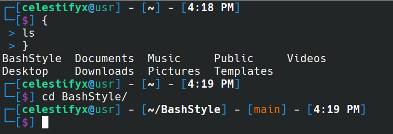

# BashStyle

This is a custom theme for Bash Shell.

## Installation

1. Clone the repository:
    ```bash
    git clone https://github.com/CelestifyX/BashStyle
    ```

2. Navigate to the project directory:
    ```bash
    cd BashStyle
    ```

3. Run `make install` to install BashStyle:
    ```bash
    make install
    ```

4. To update your current shell to Bash, exit the current terminal session:
    ```bash
    exit
    ```

## Screenshots


